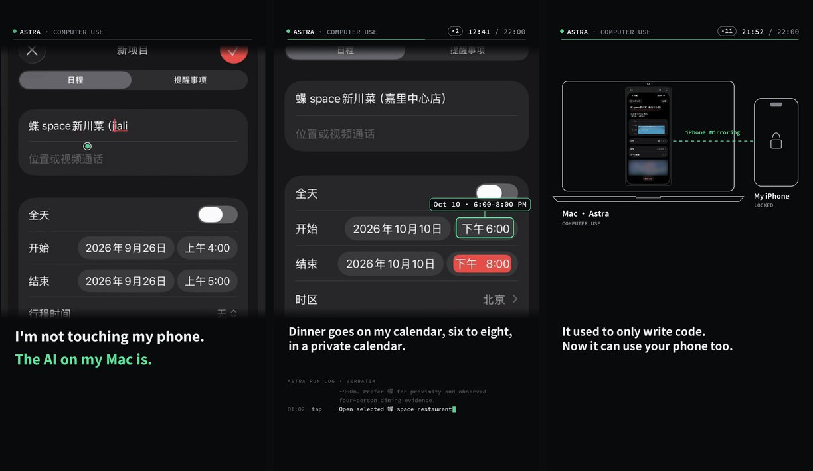

# iPhone Use

Let your AI agent use your iPhone, from your Mac, through Apple's iPhone Mirroring.



> I'm not touching my phone. The AI on my Mac is.

In the demo, a dinner question arrives in WeChat. The agent (Codex with the Astra model) compares three restaurants, adds a private calendar event for 6–8 PM, drafts the reply and leaves sending to me, then reopens the event to double-check. The phone stays locked the whole time. Real screen recording, edited and sped up; I unlocked the phone beforehand and sent the test message.

This repo is an Agent Skill: plain instructions your agent follows while it drives iPhone Mirroring with Computer Use. It has no scripts and no device driver.

## What you need

- A Mac with Apple silicon or the T2 chip on macOS 15 or later, and an iPhone on iOS 18 or later, signed in to the same Apple Account. iPhone Mirroring isn't available in the EU. Details: [Apple's article](https://support.apple.com/en-us/120421).
- An AI client that supports Computer Use, such as Codex or Claude Code, with Accessibility and Screen & System Audio Recording allowed for it on the Mac.
- iPhone Mirroring connected, with the phone locked next to the Mac. Turn on Handoff on both devices so the agent can paste text written on the Mac.

Step by step: [setup](skills/iphone-use/references/setup.md).

## Install

```bash
git clone https://github.com/why920214-cmd/iphone-use.git
```

Codex:

```bash
cp -R iphone-use/skills/iphone-use ~/.codex/skills/
```

Claude Code:

```bash
cp -R iphone-use/skills/iphone-use ~/.claude/skills/
```

Restart the client so it picks up the skill.

## Try it

- "Use iphone-use: read Sam's latest message about dinner, find a Thai place near Union Square for four on Saturday at 7, add it to my calendar, and draft a reply. Don't send it."
- "Use iphone-use: add two packs of AA batteries to my Amazon cart. Stop before checkout."
- "Use iphone-use: order me a light lunch on DoorDash under $25. Show me before paying."

While it works, keep the phone locked and leave the mirroring window alone.

## What it won't do

- It stops before paying, placing an order, requesting a ride, sending a message or posting, unless you asked for that step and it involves no money, passwords or biometrics.
- Passwords, verification codes and Face ID are always yours to do, on your own phone. The camera, microphone and Face ID aren't available through iPhone Mirroring anyway.
- It isn't for automating social accounts (bulk posting, auto-replies) or for games. Follow each app's terms.
- What the agent sees on your phone goes to your AI provider under its data policy. Don't let it open anything you'd rather it didn't see.

## Tested so far

Tested end to end with Codex (Astra) on one Mac and one iPhone, using Chinese-language apps: WeChat, Dianping, Apple Calendar, Taobao and 12306. English-language apps, other clients and other devices haven't been tested yet. See [validation](skills/iphone-use/references/validation.md) for exactly what ran, what the agent tripped over, and what's still open. Reports from your own runs are welcome as issues.

## 中文

中文版在小红书 RED Skill，搜「用 Mac 操控 iPhone」。

## Disclaimer

Not affiliated with or endorsed by Apple, OpenAI or Anthropic. iPhone and iPhone Mirroring are trademarks of Apple Inc. You're responsible for what your agent does with your accounts.

## License

[MIT](LICENSE)
